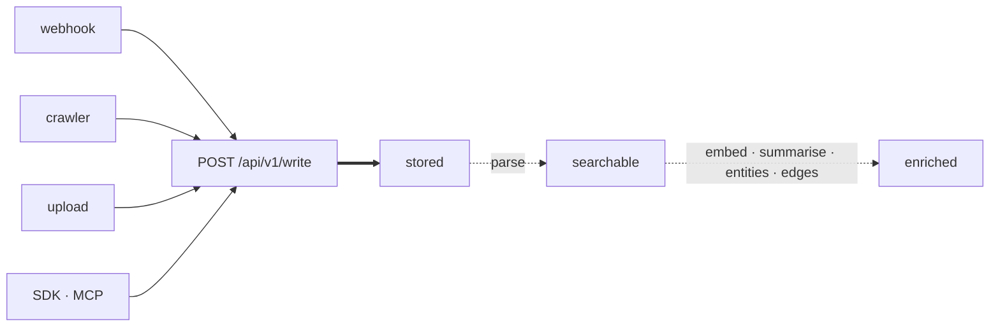
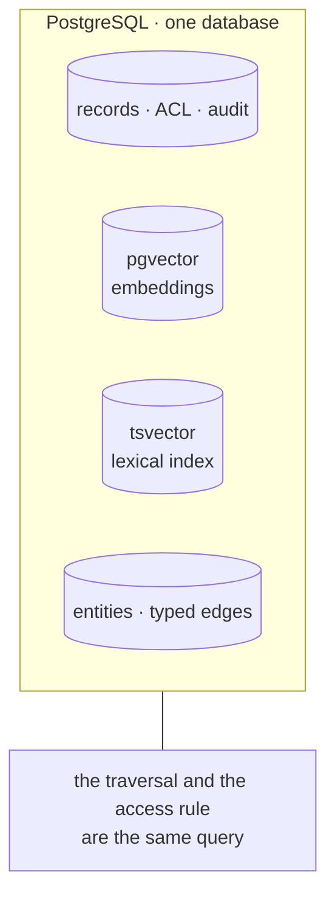
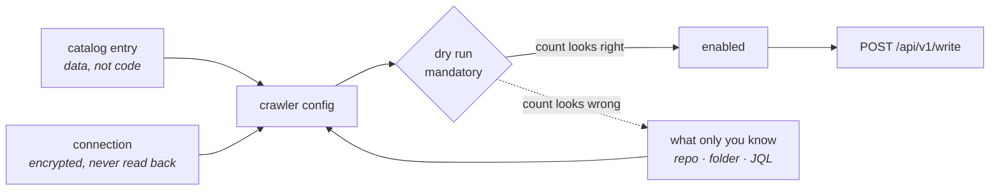
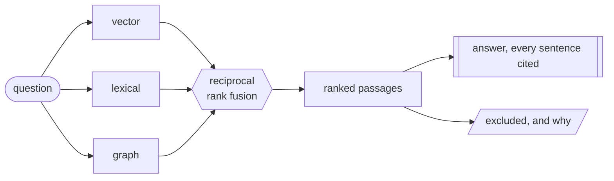

# mem-dog

**A memory layer that can show its work.**

Write anything — documents, spreadsheets, calendars, email, audio, video — and get it back by
meaning, with a trace of exactly why each result was returned and what was considered and dropped.

Most memory systems answer *what do you remember?* This one also answers **why did you say that,
which model produced it, who is allowed to see it, and can you prove you deleted it.**

```
54 file formats   ·   24 data types   ·   18 extraction prompts
9 webhook providers   ·   4 crawler strategies   ·   28 app connectors
12 graph predicates   ·   8 MCP tools   ·   110 endpoints
569 tests, against a real database, no mocks
```

The capability counts are read from the running build rather than written here — the sign-in page
gets them from `GET /api/v1/capabilities`, so a format that stops working stops being claimed.

---

## Run it

```bash
cd api
docker compose up -d                        # Postgres 16 + pgvector on :54329
uv venv --python 3.12 .venv && uv pip install -e ".[dev]"
.venv/bin/python -m pytest                  # real database, no mocks — and it drops the schema
.venv/bin/python -m memdog bootstrap        # prints an org, project, producer and key
.venv/bin/uvicorn memdog.app:app --port 8200
```

For something to look at rather than an empty database:

```bash
.venv/bin/python -m memdog seed --demo      # 42 records, one worked sales renewal
```

The seed goes in through the public write API with a registered producer, then asks the corpus five
questions and checks it answers them, checks a second member cannot read the private record, and
checks the audit log recorded the reads. **A failing seed names the step that broke** — which is the
point of it running the real path rather than inserting rows. `--reset` purges the demo through the
ordinary delete cascade and seeds again.

```bash
cd ui && npm install && npm run build
MEMDOG_API_URL=http://localhost:8200 MEMDOG_API_KEY=... \
MEMDOG_PROJECT_ID=prj_... MEMDOG_PRODUCER_ID=key_... npm start
```

**The suite drops and recreates the public schema on every test**, so it refuses to run against
anything but a database on `localhost` — an exported `DATABASE_URL` pointing at a real instance
would otherwise be exactly what it dropped. A disposable database on a remote host, such as a CI
service container, needs `I_KNOW_THIS_DATABASE_IS_DISPOSABLE=yes`.

No cloud account is needed to run the whole thing locally. The embedding engine, extractor and blob
store all have offline implementations, and they are registered models rather than mocks — their
rows carry a `model_id`, so the day a real engine is assigned the old ones are identifiable and
re-embeddable rather than quietly mixed in.

---

## The shape



**Solid is synchronous, dashed is not.** The write commits before it returns; everything after it
happens behind the request. That asymmetry is why ingest latency is a database write rather than a
model call, and why the pipeline being down delays enrichment without losing data.

Those three states are visible on every read, so *"I uploaded it and search cannot find it"* is a
state you can look at rather than a bug report.

### One store, not three



There is no vector database, no search cluster and no graph database. That is the central bet, and
it buys two things a second store cannot: a path through a record you may not read is never
returned at all, and the erasure certificate can re-query **every** table that could hold a trace —
a guarantee that stops at the database boundary is not one.

---

## What it does

| | |
|---|---|
| **One write path** | Webhook, crawler, upload, SDK — all through `POST /api/v1/write`. A crawled record and a webhook-delivered one are indistinguishable downstream |
| **Broad ingestion** | 54 formats. Audio and video transcribed, images described. The handler is chosen from sniffed bytes, never the caller's claim about them |
| **Semantic retrieval** | Vector and lexical arms fused in one query, with asymmetric document/query embedding — a question finds the passage answering it in different words |
| **Answers with evidence** | Every claim cites a passage, the passages ship with the answer, and an unsupported question is refused rather than filled in |
| **A knowledge graph** | Entities resolved cautiously, typed edges carrying the records that assert them, plus co-mentions that need no model at all |
| **Inbound webhooks** | 9 providers, each signing a different string over a different encoding |
| **Crawlers** | Templated HTTP, feeds, bounded link traversal and folder walks, with a mandatory dry run |
| **28 app connectors** | Jira, GitHub, Notion, Salesforce, Drive, SharePoint and the rest — as catalog *data*, not per-source code. None is verified, and the catalog says so |
| **Deletion that completes** | Four blast radii, async reclamation, and a certificate re-queried from every table that could hold a trace |
| **Cost, metered** | A durable row per model call — including the ones that failed, because a call that generated three thousand tokens and then timed out consumed them. Quota is weighted by what a request authorises, not by the fact that it arrived |
| **Residency, enforced** | A regulated data type is served only by a model that runs inside the deployment. Checked when a model is assigned, again when one is resolved, and again before bytes reach it |
| **Per-org model choice** | An organization assigns its own extraction and answering models, per data type, without a redeploy. Embedding stays a deployment decision — two orgs on different embedding models write vectors from different spaces into one index |

---

## Pulling from an app

A connector here is **not an adapter**. There is no per-source code and no plugin to write — an
entry is a row of knowledge about one API (the endpoint, the pagination shape, the field mapping)
that renders into a crawler config the ordinary validator accepts.



**The credential is applied last and a config cannot override it.** A config is stored, versioned
and readable; a secret templated into one is a secret in the clear. Connections are envelope-
encrypted and there is no endpoint that reads one back out — the listing reports whether one is
held, never a prefix, because a prefix is enough to confirm a guess.

Six credential styles, in two kinds. Four are presented as stored. Two are **exchanged**: a
client-credentials grant and a Google service-account assertion trade the stored secret for a token
good for an hour. That second kind is why *"Google and Microsoft need OAuth"* was wrong here for
weeks — interactive OAuth is how a **person** connects their own account; an organization
connecting its own data uses a grant with no human in it, which is a POST.

A `tree` crawler walks a Drive folder or a SharePoint library depth-first-bounded, emitting each
file as a reference rather than downloading it inline — so the bytes arrive through the same fetch
worker, byte cap and parse pipeline as an upload. Details in
[docs/ingestion/connectors.md](docs/ingestion/connectors.md).

---

## How a question is answered



Three arms, chosen per request rather than picked from a menu of preset modes. **Each applies the
access rule itself**, so fusion never sees a row the caller could not have retrieved directly — and
the graph arm reaches records that contain none of the question's words, because something else
asserted a relationship to an entity it names.

The `excluded` branch is the part that is unusual. Ranked results are ordinary; reporting the
records that were *considered and dropped* — below the threshold, or not searchable yet — is what
turns *"it is missing something I know is in there"* from an impression into a diagnosis.

---

## The four commitments

Everything above is a feature. These are the reasons to choose it.

**Retrieval reports what it excluded, and why.** Ranked results are ordinary. Returning the records
that were *considered and dropped* — below the threshold, or not searchable yet — is not.
*"Missing something I know is in there"* has several causes and they need different fixes.

**The access rule is a predicate inside the query.** Never a filter over results. Asking for ten and
hiding three is a different and worse thing than returning the right ten — and it leaks: reporting
that three were hidden discloses that they exist. The same predicate serves search, chat and graph
traversal, so there is one place for it to be wrong instead of three.

**Every derived row carries its provenance.** The model, the build that answered, and a fingerprint
of prompt + model + schema + parser + chunker. Nothing is mutated in place, so *"why does this say
something different than last week?"* has an answer, and changing a default makes everything it
produced detectably stale without anyone remembering to bump a number.

**Rows are the record of work; the queue only delivers.** A durable event log with a reconciler in
front of it. Every scale-to-zero recovery in this system falls out of that one decision.

---

## Use it from Claude

An MCP server at `/api/v1/mcp` exposes the corpus as eight tools — search, chat, add, get, list,
delete, entities, memories. Point Claude Desktop or Cursor at it with an ordinary API key:

```json
{"mcpServers": {"mem-dog": {"url": "https://<host>/api/v1/mcp",
                            "headers": {"Authorization": "Bearer <key>"}}}}
```

Each tool calls the same function its REST endpoint calls, so the credential check and the ACL
predicate are the ones that already exist — a record your key cannot fetch over HTTP is one it
cannot reach through a tool. The transport is streamable HTTP rather than the older
session-bearing SSE, because this service scales to zero and a stream and its posts would not
reliably land on the same instance.

---

## What is not built

Stated as plainly as the rest, because a README that only lists strengths is not read as confident.

- **No rating, invoicing or rollups.** Spend is metered and budgeted in cost-weighted credits, and
  credits are not currency — turning them into a bill needs a rate card, hourly rollups and
  reconciliation against provider invoices, none of which exist
- **Five schema columns are declared and wired to nothing** — the model-proposal inputs and some
  entity lifecycle fields. They are listed with reasons in `tests/test_wiring.py`, which fails if one
  is quietly added to that list, quietly removed from the schema, or quietly wired up
- **No interactive OAuth**, so a source that issues a refresh token only through a consent screen
  cannot be connected. In the catalog that is exactly one entry, Zoho CRM. It is *not* the reason
  Google and Microsoft were unreachable — that claim stood here for weeks and was wrong: an
  organization connecting its own data uses a grant with no human in it, which is a POST
- **Nothing in the connector catalog has been run against a live account.** Every entry reports
  `verified: false`, because verifying one needs a credential. The mandatory dry run is where an
  entry stops being a researched guess
- **No path finding between two named entities**, and graph retrieval walks one hop — only
  neighbourhoods, not the chain that connects two things
- **No point-in-time facts.** Edges have no validity interval, so *"who worked there in 2024"* is
  unanswerable. [Zep](https://www.getzep.com) does this natively and this does not
- **No users.** This is a prototype. [Mem0](https://mem0.ai) processes more API calls in a quarter
  than this has served in its life

---

## Where it sits

The agent-memory category — Mem0, Zep, Letta, Cognee, Supermemory — mostly optimises for adoption,
latency and time-to-first-memory. This optimises for whether you can prove what the system knew.

**Self-hosting is not the differentiator**, despite being the obvious thing to claim. Onyx is
MIT-licensed, air-gapped, SOC 2 Type II, and ships 40+ connectors; Khoj runs entirely on local
models. Private deployment is table stakes in this category, and
[the competitive research](docs/competition/README.md) says so at length.

The differentiator is the four commitments above, and they are unusual enough to be worth checking
rather than believing.

---

## The repository

| Path | What is in it |
|------|---------------|
| [`api/`](api/README.md) | The service. 56 modules, 110 endpoints, 55 tables across 29 migrations |
| [`ui/`](ui/README.md) | The console. Sign-in, ingestion, search, chat, entities, graph, crawlers, credentials, governance, MCP |
| [`docs/`](docs/README.md) | The design, in eleven parts — requirements speak in roles, products appear only in the technology documents |
| [`docs/graph.md`](docs/graph.md) | Why the graph is not a graph database, and what it costs |
| [`TBD.md`](TBD.md) | Twelve decisions designed but not decided, ordered by how expensive each becomes if made late |
| [`CHANGELOG.md`](CHANGELOG.md) | What changed and why, one entry per commit that altered behaviour |

---

## The thing that surprised us

Nearly every defect found while building this was **silent**. The request succeeded, the response
looked right, and the result was quietly wrong: a proxy that failed *open* and promoted signed-in
users to org owner; a reconcile job that re-embedded with the old model and concluded nothing was
stale; a rate limit that consumed a retry budget so a re-embed reported success having embedded
almost nothing.

The most recent one is the clearest. An enrichment failure was classified by searching its message
for `"429"` — so whether a defect was retried forever or recorded correctly depended on whether the
record's random identifier happened to contain those three characters. It surfaced as a test that
failed once and passed on every re-run.

None of those had an error to notice. That is most of why this system reports its trace, its
provenance and its exclusions — not because auditors ask for it, but because it is the only way to
see the bugs that do not announce themselves.

It is also why several tests now check the **wiring** rather than the behaviour: every setting in
the register must be read somewhere, every public function referenced, every schema column named,
every metric registered. Each exemption carries its reason and fails the moment the thing it
excuses is either wired up or removed. Those guards found seven more on their first run — including
a webhook signature verifier the request path had stopped calling, with its tests still pointed at
it. A passing test over dead code is worse than no test.
