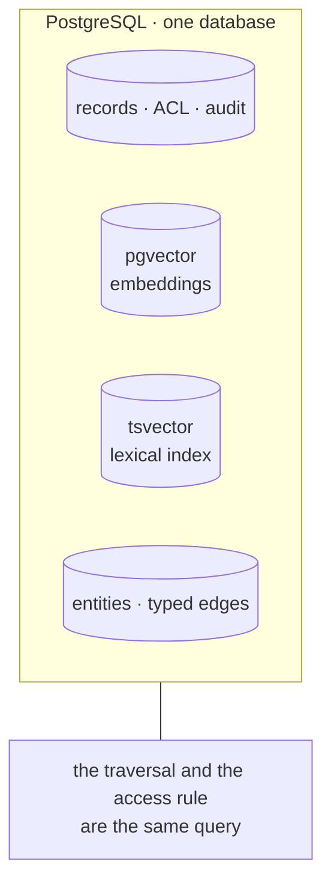
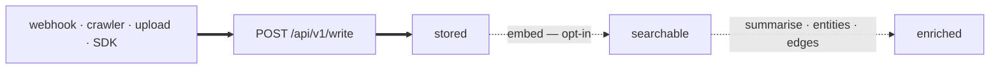

# mem-dog

**Most memory systems can tell you what they remember. This one can tell you what it *didn't*
return, and why.**

Write anything — documents, spreadsheets, email, calendars, audio, video — and get it back by
meaning. That part is table stakes. The part that is not: every answer arrives with the passages
behind it, the records that were considered and dropped, the model that produced it, and a deletion
you can prove completed.

```
54 file formats · 24 data types · 18 extraction prompts · 9 webhook providers
4 crawler strategies · 37 app connectors · 12 graph predicates · 8 MCP tools
8 alert surfaces · 134 endpoints · 630 tests, against a real database, no mocks
```

Those counts are read from the running build, not written here. The sign-in page gets them from
`GET /api/v1/capabilities`, so a format that stops working stops being claimed.

---

## The difference, in one response

A real query against a running deployment. Abridged, but nothing is invented:

```jsonc
POST /api/v1/retrieve   {"query": "what did we promise Acme about SSO", "match": ["vector","lexical","graph"]}

{
  "results": [
    { "text": "Sofia raised data residency as a blocking concern…",
      "score": 0.030, "matched_by": ["gph", "vec"], "state": "enriched" },
    { "text": "We will deliver SAML single sign-on to Acme by 30 September 2026…",
      "score": 0.016, "matched_by": ["vec"],        "state": "enriched" }
  ],
  "excluded": [
    { "data_id": "data_01M189AVAH…", "reason": "threshold", "score": 0.0161, "state": "enriched" },
    { "data_id": "data_01M189AVB9…", "reason": "threshold", "score": 0.0159, "state": "enriched" }
  ],
  "corpus":     { "total": 42, "stored": 0, "searchable": 0, "enriched": 42 },
  "model_id":   "gemini-embedding-001@768",
  "generator_version": "gen_d325cb0586ca30eabcad5539b1dc0a7c"
}
```

Read what that tells you that a ranked list does not.

**`matched_by`** — the first hit never contains the word *SSO*. It surfaced because the graph arm
walked from an entity the question named to a record that asserts a relationship to it. You can see
which arm earned each result instead of trusting a blended score.

**`excluded`** — the records that were *considered and dropped*, each with a reason. *"It's missing
something I know is in there"* has several causes and they need different fixes. Below the
threshold is a tuning problem. Not searchable yet is a pipeline problem. Not visible to you is not a
problem at all. Without this line you cannot tell which one you have.

**`corpus`** — how much of the project was eligible to match. Forty-two enriched, none merely
stored. When that second number is large, the answer is thin for a reason you can act on.

**`generator_version`** — a fingerprint of prompt + model + schema + parser + chunker. Change any of
them and everything produced by the old one becomes detectably stale, without anyone remembering to
bump a number.

---

## Same id, two keys

```bash
GET /api/v1/data/data_01M189AVW7FG67PERE2A30WR5J

  owner      → 200  {"data_id": "data_01M189AVW7…", …}
  colleague  → 404  {"detail": "not found"}
```

Same project, same org, same endpoint. A record you may not read is **indistinguishable from one
that does not exist** — because a 403 still discloses that it exists.

That falls out of one decision: **the access rule is a predicate inside the query, never a filter
over results.** Asking for ten and hiding three is a different and worse thing than returning the
right ten, and it leaks — reporting that three were hidden is the disclosure. The same predicate
serves search, chat and graph traversal, so there is one place for it to be wrong instead of three.

---

## The bet



No vector database. No search cluster. No graph database. This costs real things — it will not
outscale a dedicated store, and that is a known ceiling rather than an oversight.

It buys two that a second store cannot. A path through a record you may not read is never returned
at all, because the visibility predicate is joined into the recursive term rather than applied after
it. And an erasure certificate can re-query **every** table that could hold a trace — a guarantee
that stops at a database boundary is not a guarantee.

---

## Retrieval answers a question. An alert tells you when something happened.

The pull surface is only half of it. Declare what is worth knowing about — a
person's location changing, a record becoming org-visible, a guessed case
membership being confirmed — and it is **recorded when it happens**, then polled
from a cursor or pushed to your endpoint.

```
POST /api/v1/alerts
{ "surface": "acl.changed", "where": { "to_level": ["org"] } }
```

Three properties are load-bearing, and each is a refusal:

**No alert runs until you have replayed it against history.** A backtest runs
the live path with its writes withheld, so what it reports is what a live run
would do. Editing what an alert matches drops that approval and switches it off.

**Nothing evaluates per write.** N alerts by M writes would mean every write
paying for every alert; one crawl of ten thousand items would trigger ten
thousand rounds. A consumer wakes on a transition and then waits, evaluating
once over the batch — and the watermark in Postgres, not the queue, is what
records where it got to.

**An event carries no access level.** Visibility is the subject's, resolved when
someone reads and again when a delivery is sent. A copy taken at match time
would be stale the moment the record was re-shared, and notification is the one
side channel around every other access check.

See [`docs/alerts.md`](docs/alerts.md).

---

## Everything arrives the same way

Webhook, crawler, upload, SDK, MCP — all through `POST /api/v1/write`. A crawled record and a
webhook-delivered one are indistinguishable downstream, which is what stops a managed connector
from having powers an external client lacks.



**Solid commits before the request returns; dashed does not.** Ingest latency is a database write,
not a model call, so the pipeline being down delays enrichment without losing data.

**Both dashes are optional, and off by default for crawlers.** A crawler can discover fifty thousand
records unattended and enriching them is a model call per chunk on data nobody has asked about yet.
The price of that default is worth saying out loud: a `stored` item is durable, correct, and
**invisible to search** — both retrieval arms read the chunk table, and chunks are written by the
embed step. Which is why those three states appear in every trace.

Connectors are the same idea one level up. An entry for Jira or Salesforce or Workday is **a row of
data** — endpoint, pagination shape, field mapping — that renders into an ordinary crawler config.
No per-source code, no plugin, and a mandatory dry run before any of them can be enabled.

---

## Run it

```bash
cd api
docker compose up -d                        # Postgres 16 + pgvector on :54329
uv venv --python 3.12 .venv && uv pip install -e ".[dev]"
.venv/bin/python -m pytest                  # real database, no mocks
.venv/bin/python -m memdog bootstrap        # org, project, producer, key
.venv/bin/python -m memdog seed --demo      # 42 records, one worked sales renewal
.venv/bin/uvicorn memdog.app:app --port 8200
```

No cloud account required. The embedding engine, extractor and blob store all have offline
implementations — and they are registered *models*, not mocks, so their rows carry a `model_id` and
the day a real engine arrives the old vectors are identifiable and re-embeddable rather than quietly
mixed in.

The seed is the acceptance test. It writes through the public API with a registered producer, asks
the corpus five questions and checks it answers them, checks a colleague cannot read the private
record, and checks the audit log recorded the reads. **A failing seed names the step that broke.**

Then → **[docs/usage.md](docs/usage.md)**: six scenarios with the sequence each actually follows —
write and ask, pull from an app, receive a webhook, build the graph, backfill a crawl that ran cold,
erase with proof.

---

## What it is not

A README that only lists strengths is not read as confident.

- **No users.** This is a prototype. [Mem0](https://mem0.ai) processes more API calls in a quarter
  than this has served in its life
- **Nothing in the connector catalog has been run against a live account.** All 37 entries report
  `verified: false`, because verifying one needs somebody's credential. The mandatory dry run is
  where an entry stops being a researched guess
- **No interactive OAuth**, so a source that issues a refresh token only through a consent screen
  cannot be connected — exactly one catalog entry, Zoho CRM. It is *not* why Google and Microsoft
  were unreachable; that claim stood here for weeks and was wrong. An organization connecting its
  own data uses a grant with no human in it, which is a POST
- **No deterministic foreign-key edges.** A CRM is already a graph and `Contact.AccountId` is a
  certain fact, but the only path into the edge table is a model reading text — so an exact edge
  gets re-derived as a probabilistic one
- **No point-in-time facts.** Edges carry no validity interval, so *"who worked there in 2024"* is
  unanswerable. [Zep](https://www.getzep.com) does this natively and this does not
- **Graph retrieval walks one hop.** Neighbourhoods, not the chain connecting two named things
- **No invoicing.** Spend is metered in cost-weighted credits, and credits are not currency
- **Five schema columns are declared and wired to nothing.** Listed with reasons in
  `tests/test_wiring.py`, which fails if one is quietly added to that list, quietly removed from the
  schema, or quietly wired up

**Self-hosting is not the differentiator**, despite being the obvious thing to claim. Onyx is
MIT-licensed, air-gapped, SOC 2 Type II and ships 40+ connectors; Khoj runs entirely on local
models. Private deployment is table stakes here, and [the competitive
research](docs/competition/README.md) says so at length. The differentiator is the first two
sections of this file.

---

## Map

| Path | What is in it |
|------|---------------|
| [`docs/usage.md`](docs/usage.md) | Six scenarios against a running system — start here after `Run it` |
| [`api/`](api/README.md) | The service. 60 modules, 134 endpoints, 61 tables across 35 migrations |
| [`ui/`](ui/README.md) | The console. Ingestion, search, chat, entities, graph, crawlers, alerts, governance |
| [`docs/`](docs/README.md) | The design, in eleven parts — requirements speak in roles, products appear only in the technology documents |
| [`docs/graph.md`](docs/graph.md) | Why the graph is not a graph database, what it costs, and what was true when |
| [`docs/alerts.md`](docs/alerts.md) | Declaring an event, the backtest gate, and signed outbound delivery |
| [`TBD.md`](TBD.md) | Twelve decisions designed but not decided, ordered by how expensive each becomes if made late |
| [`CHANGELOG.md`](CHANGELOG.md) | What changed and why, one entry per commit that altered behaviour |

Use it from Claude: an MCP server at `/api/v1/mcp` exposes the corpus as eight tools with an
ordinary API key. Each calls the same function its REST endpoint calls, so a record your key cannot
fetch over HTTP is one it cannot reach through a tool.
