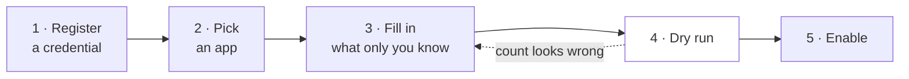
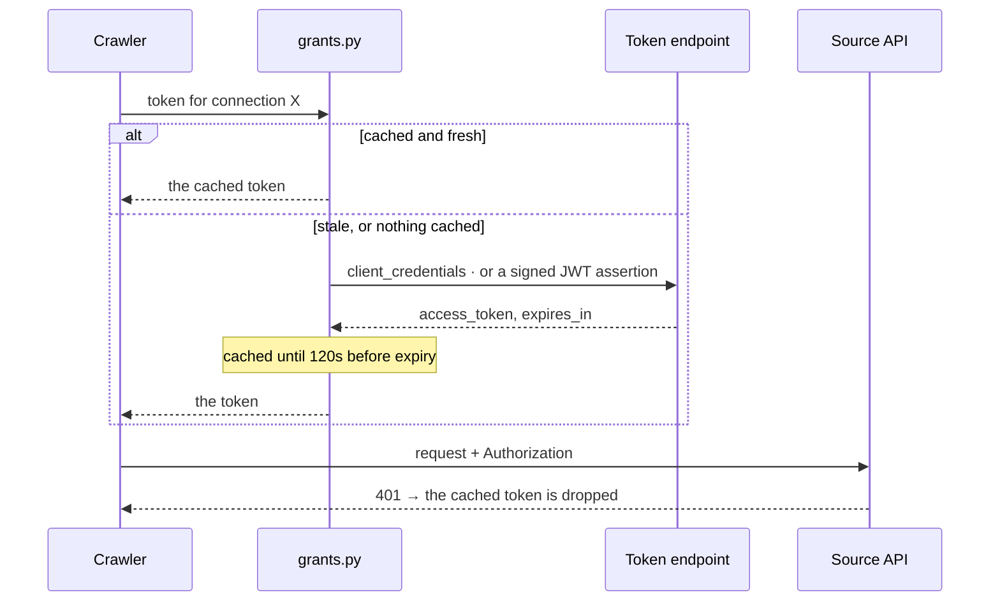

# Connectors

A connector is **not an adapter**. There is no per-source code in this repository and no plugin to
write. A connector is a catalog entry — a row of knowledge about one API, stored as data in
[`api/src/memdog/connectors.py`](../../api/src/memdog/connectors.py) — that renders into a
[crawler](crawlers.md) config the ordinary validator accepts.

That distinction is the whole design. The crawler could already reach any REST API with a
credential; what nobody had was the endpoint, the pagination shape and the field mapping. Writing
those down as data is what makes "we support Jira" a twenty-line entry rather than a module.

> **Nothing in the catalog is verified.** `verified` is `false` on every entry, and it means what it
> says: nobody has run it against a live account, because that needs a credential. An entry is a
> researched guess until the dry run every crawler must pass turns it into a fact. This is stated in
> the console too.

---

## The process, end to end

Five steps, all in the console, none of them code.



**1 · Register a credential.** Console → *Credentials*. Pick how the source wants it presented and
paste the secret. It is envelope-encrypted on the way in and **there is no endpoint that reads one
back out** — the listing reports whether one is held, never a prefix, because a prefix is enough to
confirm a guess.

**2 · Pick an app.** Console → *Pull from an app*. The catalog is grouped by category and readable
without an account, so you can see what is supported before you have one.

**3 · Fill in what only you know.** Each entry declares its *scopes* — the Jira site, the GitHub
repo, the Drive folder id. The endpoint, pagination and field mapping are already in the entry. A
missing scope value is refused rather than rendered as `{database}` into a URL, because that request
would authenticate, 404, and read as a broken integration rather than an unfinished form.

**4 · Dry run.** Every crawler is created **disabled and draft**, and stays that way until a dry run
passes. The dry run walks the identical code and stops short of the write, so the count it reports
is what a live run would do. This is where an entry stops being a guess.

**5 · Enable.** Enrichment is off by default and worth leaving off until you have seen the dry run's
count — a crawler can discover fifty thousand records unattended, and enriching them is a model call
per chunk on data nobody has asked a question about yet.

---

## Credentials: presented, or exchanged

Six styles, closed. Keeping the set closed is what stops a secret drifting back into a templated
header, where it would be readable by anyone who can read a config.

**Four are presented as stored.**

| Style | The stored secret | Goes out as |
|-------|-------------------|-------------|
| `bearer` | the token | `Authorization: Bearer <token>` |
| `header` | the token | a header you name — `X-Api-Key`, `Xero-Tenant-Id` |
| `query` | the token | a query parameter you name |
| `basic` | `user:password` | `Authorization: Basic <base64>` |

**Two are exchanged before use** — the stored secret buys a token that lives an hour.

| Style | The stored secret | Also needs | Used by |
|-------|-------------------|------------|---------|
| `client_credentials` | `client_id:client_secret` | `token_url`, `scope` | Microsoft Graph, Salesforce, Zoom, Xero |
| `google_service_account` | the JSON key file, whole | `scope`, optionally `subject` | Drive, Gmail, Calendar |

### The correction this section records

"Google and Microsoft need OAuth" was said in this repository for weeks, and it was only ever true
of one thing: a **person** connecting their own account, which needs a browser, a redirect and a
consent screen. An **organization** connecting its own data uses a grant with no human in it at all
— which is a POST.



Two details in that picture are load-bearing. The **120-second skew margin** exists because a token
treated as valid until the instant it expires produces a request that leaves here fine and arrives
expired — and that failure reads as a permissions problem, which sends whoever debugs it somewhere
else entirely. And a **401 from the source evicts the cache**, because otherwise a credential that
started being refused would go on being refused with the same dead token for up to an hour after
somebody fixed it.

`subject` on a Google connection is **domain-wide delegation**: the assertion says "acting as this
user", which is how one credential reads many mailboxes without any of their owners doing anything.
It is never set by default, because an assertion that impersonates by default is one nobody chose.

---

## What is in the catalog

37 entries. 36 usable; one blocked, and listed anyway — hiding it would make the catalog look
complete.

| Category | Entries |
|----------|---------|
| **Issues and projects** | Jira · GitHub · Linear · Asana |
| **CRM** | Salesforce · HubSpot · Dynamics 365 · Pipedrive · Close · Copper · Freshsales · Zendesk Sell · Capsule · Attio · Affinity · ~~Zoho CRM~~ |
| **Documents and knowledge** | Notion · Confluence |
| **Support** | Zendesk · Intercom · Freshdesk |
| **Commerce** | Shopify · Stripe |
| **People** | Greenhouse · BambooHR · Workday (custom report) · Workday (workers) |
| **Google** | Drive · Drive (folder tree) · Gmail · Calendar |
| **Microsoft** | SharePoint · SharePoint (library tree) · OneDrive · OneDrive (drive tree) · Outlook · Teams |

### Workday, twice

Workday is two entries because it has two ways in and they are not equivalent.

| | Auth | Paging | When |
|---|---|---|---|
| **Custom report** (`workday_report`) | basic, an integration system user | none — the report is one document | always works; RaaS with an ISU is how bulk data leaves Workday |
| **Workers** (`workday_workers`) | `client_credentials` | `offset` / `limit` | cleaner, and conditional — the grant must be enabled, and some tenants permit only the JWT bearer grant, which is not one of the six styles |

The report entry asks for an **ID column**, because a Workday report names its columns after their
labels and there is no id to default to. Dynamics 365 asks the same question for the same reason —
Dataverse names a primary key after its singular table (`accountid`, `contactid`). Guessing either
would produce a crawler that pulls rows and then hashes every one of them into a fresh record on the
next run, which looks like duplication rather than a missing field.

**Zoho CRM is the one genuine OAuth case.** It issues a refresh token only through a one-time
interactive authorization — there is no non-interactive grant to substitute. It stays blocked with
that reason attached rather than silently absent.

### Listing versus walking

Drive, SharePoint and OneDrive each appear twice, and the pair is not redundant.

| | What it stores | Requests |
|---|---|---|
| **Listing** (`google_drive`) | one folder's file names, ids and links | one, paged |
| **Tree** (`google_drive_tree`) | every document under the folder, contents included | one per folder, plus one per file |

Someone choosing between them is choosing between a **file index** and a **corpus**, which is worth
two names. The tree strategy is documented in [crawlers.md](crawlers.md#tree).

---

## Adding an entry

An entry is data. Adding one is a pull request against a tuple, and it needs no new code path:

```python
Connector(
    key="acme_tickets", label="Acme", category="Support",
    pulls="Tickets in a queue",
    auth_style="bearer", auth_help="A personal token from Settings → API.",
    scopes=(Scope("queue", "Queue ID", "eng-inbound"),),
    template=_http(
        "https://api.acme.com/v2/queues/{queue}/tickets",
        items="tickets[*]", id_path="id", title="subject",
        content="body", url_path="url", version="updated_at",
        pagination={"type": "cursor", "cursor_path": "next",
                    "cursor_param": "cursor"},
    ),
)
```

The tests enforce the parts that matter: every entry must render into a config the crawler validator
accepts, must declare a stable `id_path`, must leave no `{placeholder}` in a rendered URL, must
declare how its credential is presented, and must not claim to be verified.

**Declare what only the operator knows; never guess it.** A guessed subdomain authenticates,
returns a 404, and reads as a broken integration.

---

## What a connector is not

Some sources are genuinely a different shape, and the catalog does not pretend otherwise:

- **Streams** (Slack Socket Mode, Telegram long-polling) need a persistent connection, not a
  scheduled pull. Those arrive through the [webhook](../ingestion/write-api.md) path instead.
- **Fan-out sources** (a Zoom recording becoming video, audio, transcript and chat) need one arrival
  to produce several records.
- **Warehouses** (BigQuery, Snowflake) are a cursor on a column — closer to a query than a crawl.

These are on the [roadmap](../roadmap.md), not in the catalog. Listing them here would inflate the
count, which is the failure mode this file was rewritten to remove.
