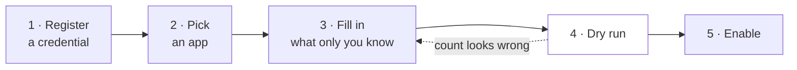
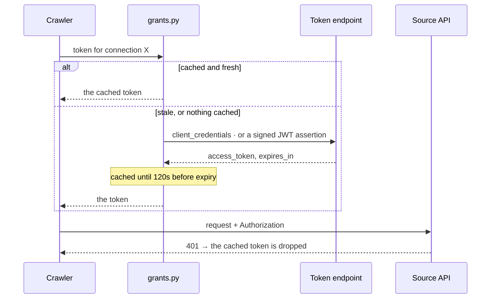

# Connectors

A connector is **not an adapter**. There is no per-source code in this repository and no plugin to
write. A connector is a catalog entry — a row of knowledge about one API, stored as data in
[`api/src/memdog/connectors.py`](../../api/src/memdog/connectors.py) — that renders into a
[crawler](crawlers.md) config the ordinary validator accepts.

That distinction is the whole design. The crawler could already reach any REST API with a
credential; what nobody had was the endpoint, the pagination shape and the field mapping. Writing
those down as data is what makes "we support Jira" a twenty-line entry rather than a module.

> **Nothing in the catalog is verified.** `verified` is `false` on every entry, and it means what it
> says: nobody has run it against a live account, because that needs a credential. An entry is a
> researched guess until the dry run every crawler must pass turns it into a fact. This is stated in
> the console too.
>
> One entry now carries the weaker claim `exercised_against`. See
> [Exercising a template without a tenant](#exercising-a-template-without-a-tenant).

---

## The process, end to end

Five steps, all in the console, none of them code.



**1 · Register a credential.** Console → *Credentials*. Pick how the source wants it presented and
paste the secret. It is envelope-encrypted on the way in and **there is no endpoint that reads one
back out** — the listing reports whether one is held, never a prefix, because a prefix is enough to
confirm a guess.

**2 · Pick an app.** Console → *Pull from an app*. The catalog is grouped by category and readable
without an account, so you can see what is supported before you have one.

**3 · Fill in what only you know.** Each entry declares its *scopes* — the Jira site, the GitHub
repo, the Drive folder id. The endpoint, pagination and field mapping are already in the entry. A
missing scope value is refused rather than rendered as `{database}` into a URL, because that request
would authenticate, 404, and read as a broken integration rather than an unfinished form.

**4 · Dry run.** Every crawler is created **disabled and draft**, and stays that way until a dry run
passes. The dry run walks the identical code and stops short of the write, so the count it reports
is what a live run would do. This is where an entry stops being a guess.

**5 · Enable.** Enrichment is off by default and worth leaving off until you have seen the dry run's
count — a crawler can discover fifty thousand records unattended, and enriching them is a model call
per chunk on data nobody has asked a question about yet.

---

## Credentials: presented, or exchanged

Six styles, closed. Keeping the set closed is what stops a secret drifting back into a templated
header, where it would be readable by anyone who can read a config.

**Four are presented as stored.**

| Style | The stored secret | Goes out as |
|-------|-------------------|-------------|
| `bearer` | the token | `Authorization: Bearer <token>` |
| `header` | the token | a header you name — `X-Api-Key`, `Xero-Tenant-Id` |
| `query` | the token | a query parameter you name |
| `basic` | `user:password` | `Authorization: Basic <base64>` |

**Two are exchanged before use** — the stored secret buys a token that lives an hour.

| Style | The stored secret | Also needs | Used by |
|-------|-------------------|------------|---------|
| `client_credentials` | `client_id:client_secret` | `token_url`, `scope` | Microsoft Graph, Salesforce, Zoom, Xero |
| `google_service_account` | the JSON key file, whole | `scope`, optionally `subject` | Drive, Gmail, Calendar |

### The correction this section records

"Google and Microsoft need OAuth" was said in this repository for weeks, and it was only ever true
of one thing: a **person** connecting their own account, which needs a browser, a redirect and a
consent screen. An **organization** connecting its own data uses a grant with no human in it at all
— which is a POST.



Two details in that picture are load-bearing. The **120-second skew margin** exists because a token
treated as valid until the instant it expires produces a request that leaves here fine and arrives
expired — and that failure reads as a permissions problem, which sends whoever debugs it somewhere
else entirely. And a **401 from the source evicts the cache**, because otherwise a credential that
started being refused would go on being refused with the same dead token for up to an hour after
somebody fixed it.

`subject` on a Google connection is **domain-wide delegation**: the assertion says "acting as this
user", which is how one credential reads many mailboxes without any of their owners doing anything.
It is never set by default, because an assertion that impersonates by default is one nobody chose.

---

## What is in the catalog

37 entries. 36 usable; one blocked, and listed anyway — hiding it would make the catalog look
complete.

| Category | Entries |
|----------|---------|
| **Issues and projects** | Jira · GitHub · Linear · Asana |
| **CRM** | Salesforce · HubSpot · Dynamics 365 · Pipedrive · Close · Copper · Freshsales · Zendesk Sell · Capsule · Attio · Affinity · ~~Zoho CRM~~ |
| **Documents and knowledge** | Notion · Confluence |
| **Support** | Zendesk · Intercom · Freshdesk |
| **Commerce** | Shopify · Stripe |
| **People** | Greenhouse · BambooHR · Workday (custom report) · Workday (workers) |
| **Google** | Drive · Drive (folder tree) · Gmail · Calendar |
| **Microsoft** | SharePoint · SharePoint (library tree) · OneDrive · OneDrive (drive tree) · Outlook · Teams |

### Workday, twice

Workday is two entries because it has two ways in and they are not equivalent.

| | Auth | Paging | When |
|---|---|---|---|
| **Custom report** (`workday_report`) | basic, an integration system user | none — the report is one document | always works; RaaS with an ISU is how bulk data leaves Workday |
| **Workers** (`workday_workers`) | `client_credentials` | `offset` / `limit` | cleaner, and conditional — the grant must be enabled, and some tenants permit only the JWT bearer grant, which is not one of the six styles |

The report entry asks for an **ID column**, because a Workday report names its columns after their
labels and there is no id to default to. Dynamics 365 asks the same question for the same reason —
Dataverse names a primary key after its singular table (`accountid`, `contactid`). Guessing either
would produce a crawler that pulls rows and then hashes every one of them into a fresh record on the
next run, which looks like duplication rather than a missing field.

**Zoho CRM is the one genuine OAuth case.** It issues a refresh token only through a one-time
interactive authorization — there is no non-interactive grant to substitute. It stays blocked with
that reason attached rather than silently absent.

### Listing versus walking

Drive, SharePoint and OneDrive each appear twice, and the pair is not redundant.

| | What it stores | Requests |
|---|---|---|
| **Listing** (`google_drive`) | one folder's file names, ids and links | one, paged |
| **Tree** (`google_drive_tree`) | every document under the folder, contents included | one per folder, plus one per file |

Someone choosing between them is choosing between a **file index** and a **corpus**, which is worth
two names. The tree strategy is documented in [crawlers.md](crawlers.md#tree).

---

## Adding an entry

An entry is data. Adding one is a pull request against a tuple, and it needs no new code path:

```python
Connector(
    key="acme_tickets", label="Acme", category="Support",
    pulls="Tickets in a queue",
    auth_style="bearer", auth_help="A personal token from Settings → API.",
    scopes=(Scope("queue", "Queue ID", "eng-inbound"),),
    template=_http(
        "https://api.acme.com/v2/queues/{queue}/tickets",
        items="tickets[*]", id_path="id", title="subject",
        content="body", url_path="url", version="updated_at",
        pagination={"type": "cursor", "cursor_path": "next",
                    "cursor_param": "cursor"},
    ),
)
```

The tests enforce the parts that matter: every entry must render into a config the crawler validator
accepts, must declare a stable `id_path`, must leave no `{placeholder}` in a rendered URL, must
declare how its credential is presented, and must not claim to be verified.

**Declare what only the operator knows; never guess it.** A guessed subdomain authenticates,
returns a 404, and reads as a broken integration.

---

## Exercising a template without a tenant

Verification needs somebody's credential, which is why nothing has it. But most of what goes wrong
in a template is *mechanical* — the paging shape, the field paths, the incremental clause — and none
of that needs a real account to get wrong. It needs something that answers in the provider's shape.

[`api/tools/fake_salesforce.py`](../../api/tools/fake_salesforce.py) is that, for Salesforce: the
client-credentials token exchange, the `{totalSize, done, records, nextRecordsUrl}` envelope, a real
`WHERE LastModifiedDate >` filter, and paging behind an opaque query locator.
`api/tests/test_connector_salesforce.py` crawls it with the shipped template.

**Running it found two defects that reading it could not.**

- The template paged by putting `nextRecordsUrl` into a **query parameter**. Salesforce returns it
  as a *path*, so the crawler re-requested page one until it hit `max_pages` — twenty pages, forty
  records, four of them distinct, and a run that looks entirely successful. Nothing in the config
  is wrong on its face; the type simply did not exist. It does now: `pagination.type: "next_url"`
  follows a URL the body hands back, which is also how Microsoft Graph (`@odata.nextLink`) pages —
  the Dynamics entry had a note admitting it "pulls one page", and no longer does.
- The `soql` scope had no incremental clause, so every run re-read the whole object. It now ships
  with `WHERE LastModifiedDate > {{ watermark_or_epoch }}`. The `_or_epoch` half matters: plain
  `{{ watermark }}` renders empty on the first run and Salesforce answers `MALFORMED_QUERY`, so the
  clause would work on every run except the one that sets it up.

### Incremental, and the 13 that still are not

Thirty-six of thirty-seven templates re-read their whole source on every
scheduled run. That is not a missing feature — it is a cost and rate-limit
problem that surfaces on day two of a pilot, and it was invisible because a full
re-read returns the right records and raises nothing.

**Fourteen now pull incrementally.** Two mechanisms, and which one a provider
wants is not something a reader should have to infer, so both are declared:

- `watermark_param` — the watermark goes in a query parameter the provider
  defines: `since` (GitHub), `modified_since` (Asana), `updatedMin` (Calendar),
  `updated_at_min` (Shopify), `updated_since` (Freshdesk), `updated_after`
  (Greenhouse), `date_updated__gt` (Close).
- `{{ watermark_or_epoch }}` inside a query value — Salesforce's SOQL, Jira's
  JQL, Drive's `q`, and the OData `$filter` family (Dynamics, Outlook,
  SharePoint, OneDrive, Teams).

The `_or_epoch` half is not decoration: plain `{{ watermark }}` renders empty on
the first run, and a provider handed `updated > ""` answers with a syntax error.
The clause would work on every run except the one that sets it up.

**The remaining 13 are exempted individually, with the reason**, in
`NO_INCREMENTAL` in `api/tests/test_connectors.py`. That list is the point: a
wrong filter parameter is *silent* — the request succeeds, matches nothing, and
now carries a label claiming it was fixed. Stripe's `created` is a unix
timestamp compared as a string; Zendesk's incremental reads come from a
different endpoint entirely; Confluence's CQL is date-granular, so an hourly run
would re-read the whole day.

Two tests keep it honest, and both are ratchets rather than one-off sweeps:

- A template claiming `incremental` must actually consume the watermark —
  checked against the **built** config, not the raw template, because Salesforce
  and Jira carry the clause inside a scope the operator fills in. It caught both
  on its first run.
- A template with a modified-time field must either use it or be named in
  `NO_INCREMENTAL`. Adding an entry is allowed; adding one without a reason is
  not, and removing one is the work.

### `method` and `body` were declared and never read

Found while surveying the catalog for the above. `HttpRequest` has always had
`method` and `body`; `discover_http` called `client.get()` unconditionally. Four
entries — Linear, Notion, Attio and Copper — declared a POST with a search body
and were issued as a **bodyless GET**. For Linear, which is GraphQL, that is not
a degraded request but a meaningless one.

The body is also templated now (recursively, since these filters nest two levels
down), which is what makes an incremental clause expressible for any provider
whose filter lives in the body rather than the query string.

`fake_sources.py` serves a GraphQL-shaped POST endpoint so this is run rather
than asserted — and it answers an **unrendered** `{{ watermark }}` with an error
rather than an empty list, because a placeholder reaching a provider as a
literal date returns nothing and reads as "no changes".

### The other four pagination shapes

Salesforce covered one mechanism. [`api/tools/fake_sources.py`](../../api/tools/fake_sources.py)
covers the rest, because each is a different code path through `discover_http` and each has
connectors depending on it — and paging is where templates are wrong.

| Path | Shape | Who pages this way | What the simulator makes go wrong |
|---|---|---|---|
| `/gh` | `Link: <…>; rel="next"` | GitHub, most of REST | sends `rel="last"` **first**, so a parser that takes the first `<…>` jumps to the end and stops |
| `/jira` | `startAt` / `maxResults` / `total` | Jira, Confluence, Zendesk | the client does the arithmetic, so an off-by-one repeats or skips a record per page |
| `/graph` | `@odata.nextLink`, **absolute** | Graph, Dynamics | resolves down a different branch than Salesforce's *path*, though both are `next_url` |
| `/pages` | `page=N` + `has_more` | Notion, Linear, Front | no cursor and no total: only `stop_when` ends the crawl |
| `/feed.xml` | RSS with `pubDate` | every feed connector | contains a bare `&` — invalid XML, and extremely common |

**The simulator counts requests, and the tests assert on the count.** The crawler's own `Budget`
counts *items*, so nothing in-process can tell "five records in three requests" from "five records
in twenty" — and that distinction is the whole Salesforce defect. Over-fetching returns the right
items and raises nothing, so an item count can never detect it.

Every source also applies a real incremental filter, so a template claiming `incremental` and not
having it fails here rather than on somebody's rate limit.

### The origin guard

A next URL is attacker-controlled if the source is, so `_next_url` resolves it and then **refuses
any move off the origin the run started on** — otherwise a source could redirect an authenticated
crawler, carrying the connection's credential, at a host of its choosing.

The limits are worth stating plainly, because this is exactly the kind of claim that decays into a
stronger one. A simulator cannot tell you the scope names match what the provider calls them, that
the permission model allows the read, that the rate limits are survivable, or that the connected app
can be configured the way the `auth_help` says. `verified` still means a live account, and the test
asserts an entry never claims both.

---

## What a connector is not

Some sources are genuinely a different shape, and the catalog does not pretend otherwise:

- **Streams** (Slack Socket Mode, Telegram long-polling) need a persistent connection, not a
  scheduled pull. Those arrive through the [webhook](../ingestion/write-api.md) path instead.
- **Fan-out sources** (a Zoom recording becoming video, audio, transcript and chat) need one arrival
  to produce several records.
- **Warehouses** (BigQuery, Snowflake) are a cursor on a column — closer to a query than a crawl.

These are on the [roadmap](../roadmap.md), not in the catalog. Listing them here would inflate the
count, which is the failure mode this file was rewritten to remove.
