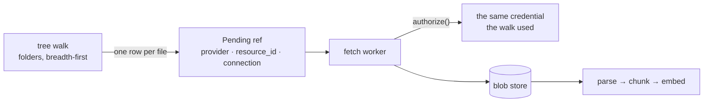

# Crawlers

Every other ingestion path waits to be told: a webhook fires, a user uploads, an SDK calls. But
most data does not announce itself. A Salesforce org has three years of opportunities nobody will
re-save. A documentation site has four hundred pages and no webhook. A review platform has no
push mechanism at all.

## This simplifies the taxonomy rather than extending it

Backfill and polling are **two schedules of the same thing**. A backfill is a crawl with
full-history scope run once; a poll is a crawl with watermark scope run on an interval; a web
crawl is the same machinery with link traversal as its discovery strategy. One configurable
worker, four discovery strategies — the taxonomy shrinks from nine classes to eight.

## The crawler does not fetch, and does not enrich

It **discovers** and **emits**. Everything downstream already exists.

```
crawler config (stored, versioned)
      ↓
  scheduler (cron · interval · manual)
      ↓
  crawl run ──── discover → frontier
      │              ↓
      │        dedupe store (external_id · etag · hash)
      │              ↓
      └── emit ──▶ POST /api/v1/write
                        │   records → Inline
                        │   files   → Pending  → W2 fetch
                        ↓
                  W1 enrich (unchanged)
```

Because crawlers write through the same contracts as every other producer, a crawled Salesforce
record and a webhook-delivered one are indistinguishable downstream — and a crawler can run
outside the cluster entirely.

## Four discovery strategies

The design document listed six. The implementation has four, because three of them — enumerate,
query and search — turned out to differ in **pagination shape and field names, not in kind**. All
three are a templated request against a JSON API, so all three are `http`.

| Strategy | How it enumerates | Example | Incremental by |
|----------|-------------------|---------|----------------|
| **http** | A templated request with declared pagination | Jira issues, SOQL, a saved search, a review feed | watermark param, or content hash |
| **feed** | Read an index someone already maintains | RSS, Atom, sitemap | entry id / pubdate |
| **traverse** | Follow links from seeds | Website, wiki, docs site | etag / last-modified |
| **tree** | Walk a folder hierarchy | Drive folder, SharePoint library, OneDrive | modified time |

That collapse is the point. The pull-only connectors in the catalog — review platforms, app stores,
warehouses — stop needing bespoke code and become configuration, because `http` already covers
enumerate, query and search for most REST APIs.

<a id="tree"></a>
### tree — walking a document library

Listing one folder is one request; a shared drive is a tree. `tree` is bounded the same way
`traverse` is, by `max_depth` and by the run's item and wall-clock budget — a drive nobody has
pruned in three years is exactly where an unbounded walk finds forty thousand files.

Two APIs, closed: `google_drive` and `microsoft_graph`. They are named rather than templated
because folder recursion is the one thing whose shape genuinely differs between them — Drive asks
for children with a query (`'<id>' in parents`), Graph asks with a path (`/items/<id>/children`),
and a folder is marked by a mime type in one and a facet in the other.

```json
{
  "strategy": "tree",
  "tree": {
    "api": "google_drive",
    "root": "1AbCdEf...",
    "include_mime": ["application/pdf", "text/"]
  },
  "limits": { "max_depth": 4, "max_items": 5000 }
}
```

`include_mime` is an allowlist of prefixes. Empty means every file, which is usually not what
anyone wants of a shared drive.

**It discovers references, not documents.** A listing returns a name, an id and a modified time;
the bytes are a second request per file. Each file is emitted as a `Pending` ref naming the same
connection, and the fetch worker resolves it — which puts that download where the byte cap, the
blob store and the parse pipeline already are, rather than inside a discovery pass holding a run
open.



Google's own formats have no bytes to download — `?alt=media` on a Doc is a 403 — so Docs and
Slides are **exported as text** and Sheets as CSV. That export format is the decision about what
gets indexed. A Drive shortcut can make the tree a graph, so folders already visited are skipped;
without that, a cycle walks until the budget runs out.

Both APIs answer a download with a redirect to a pre-signed CDN URL, and the `Authorization` header
is **dropped on any cross-host redirect** — forwarding it would hand an access token to a host that
never needed one.

## Credentials

A crawler authenticates through a **connection**, not through its config. The config is stored,
versioned and readable by anyone who can read a crawler; a credential in it would be a secret in the
clear, next to the `connections` table that exists to hold one enveloped.

```
POST /api/v1/connections   {"project_id", "provider", "credential",
                            "auth_style", "auth_name", "auth_config"}
PATCH /api/v1/crawlers/{id}/connection   {"connection_id"}
```

Six auth styles, closed, in two kinds. Four are **presented as stored** — `bearer`, `header` (with
a name), `query` (with a name), `basic`. Two are **exchanged before use**: `client_credentials` and
`google_service_account` trade the stored secret for a token that lives an hour, and take their
non-secret settings (token endpoint, scopes, an optional delegated subject) in `auth_config`, which
is reviewable in full because it holds no secret by construction. See
[connectors.md](connectors.md#credentials-presented-or-exchanged).

APIs differ here far more than they differ in pagination, and the difference is small enough to be
data. An open "template the header yourself" field would put the secret back where this took it out
of — so **the credential is applied last and a config cannot override it**.

`auth_style: header` and `query` refuse without an `auth_name`. Defaulting to `X-Api-Key` would send
the secret to a header the source ignores, and the failure would read as a wrong credential rather
than a wrong configuration.

**A credential is written and never read back.** Listing reports whether one is held, never a prefix
— a prefix is enough to confirm a guess. The plaintext exists only in the expression that builds the
request.

**No connection is not a degraded case.** A sitemap or an RSS feed needs nobody's permission, and
`connection_id` is null for them. A crawler that *does* name a connection and cannot decrypt it
fails as a configuration error rather than reaching its source unauthenticated — a run that carried
on would report the source's 401 and send whoever debugs it in the wrong direction.

**A source's 401 drops the cached token.** An exchanged credential is held until shortly before it
expires, so a source that starts refusing — consent revoked, a scope changed, the secret rotated at
the provider — would go on being refused with the same dead token for up to an hour after somebody
fixed it, and the fix would look like it had not worked.

The connection cannot be deleted while a crawler points at it. Removing it would leave that crawler
enabled, scheduled, and failing every tick with an authentication error: nothing errors loudly and
the data simply stops arriving.

---

## Anatomy of a config

Declarative and stored, following the pattern already used for agent configs and normalization
schemas — database-resident, versioned, read per run, no redeploy.

| Field | Purpose |
|-------|---------|
| `source` | Connection reference, or `public` for unauthenticated web |
| `strategy` | http · feed · traverse · tree |
| `scope` | Object types, URL patterns, folder roots, filters — **what is in bounds** |
| `schedule` | cron · interval · once · manual |
| `incremental` | Watermark field, cursor, etag mode, or full-refresh |
| `limits` | Max items · max depth · rate · concurrency · **token budget** · wall-clock cap |
| `mapping` | Normalization schema + field mapping to apply |
| `output` | Project, memory type, tags, **ACL — inherited from the connection** |
| `politeness` | Respect robots · crawl-delay · user-agent identity *(traverse only)* |
| `priority` | live · normal · **bulk** — bulk never starves event-driven work |

## Run lifecycle

A three-day backfill must survive a pod restart, so a run is a first-class checkpointed entity.

| Concern | Behaviour |
|---------|-----------|
| Run states | `pending → running → completed \| failed \| cancelled \| partial` |
| Frontier | `queued → in-flight → done \| error \| skipped` |
| Checkpoint | Cursor plus frontier snapshot — resume, never restart |
| Control | Pause, resume, cancel, dry-run |
| Overlap | A run must not start while the previous is live — skip or queue, declared per config |
| Partial success | An error on one item does not fail the run; it is recorded and the run continues |

### Dry-run is not optional

A misconfigured `traverse` crawler with a loose URL pattern will happily ingest the public
internet on the customer's inference budget. Every config must be runnable in **dry-run** —
enumerate and report counts, fetch nothing, write nothing, spend nothing — before it is scheduled.

## Deduplication and change detection

Without change detection, a nightly crawl of 50,000 records re-embeds 50,000 records every night.
Three layers:

- **`external_id` upsert** — preserves `data_id` so a re-crawl updates rather than duplicates
- **Etag / last-modified** — skip before fetching, the cheapest possible check
- **Content hash** — skip enrichment when bytes are unchanged even if metadata moved

When content *has* changed, that is a revision — which routes into **W8 mutate**: new version,
re-embed, and invalidate the facts derived from the superseded version.

## Web crawling has obligations the others don't

| Requirement | Why |
|-------------|-----|
| **Honour `robots.txt` and crawl-delay** | Non-negotiable; also the cheapest way to avoid being blocked |
| **Identifying user-agent with a contact URL** | Operators need a way to reach you rather than blackhole you |
| Per-host concurrency cap and backoff | One crawler must not degrade someone else's site |
| Scope allowlist, not blocklist | Link traversal escapes any blocklist eventually |
| No authenticated crawling of third-party sites | Crawl what the tenant owns or what is public |
| Provenance tagging | Publicly-sourced content carries different licensing exposure and must be distinguishable at retrieval |

## Customization

Crawling has to reach APIs nobody wrote an adapter for, so the config has to be more expressive
than "pick a strategy". The spectrum runs from declarative to fully external, and **we deliberately
stop before executing user code.**

| Level | What the user supplies | Runs where |
|-------|----------------------|------------|
| **0 · Preset** | A strategy plus scope | Our workers |
| **1 · Templated HTTP** | Request template, pagination shape, extraction paths | Our workers |
| **2 · Expressions** | JMESPath transforms, computed fields, filter predicates | Our workers |
| **3 · External crawler** | Their own code, in their own runtime, writing through our API | **Their infrastructure** |
| **4 · ETL platform** | An existing tool configured to target our ingest API | **Their infrastructure** |

Levels 0–2 are declarative and safe. Levels 3–4 need nothing from us but a good API. **There is no
level between them** — no plugin sandbox, no user-supplied Python in our workers. Running arbitrary
tenant code inside a multi-tenant worker means building a function-as-a-service platform with the
security surface that implies, and the escape hatch is strictly better: their runtime, their
dependencies, their scaling, their blast radius.

### The templated HTTP strategy

One generic strategy covers most "we need to pull from X" cases without any adapter work:

```yaml
strategy: http
source:  { connection_id: conn_01JQRS... }   # or public

request:
  method: GET
  url: "https://api.example.com/v2/items"
  query:
    updated_since: "{{ watermark }}"
    limit: 200
  headers:
    Accept: application/json

pagination:
  type: cursor            # cursor | offset | page | link_header
  cursor_path: "meta.next_cursor"
  cursor_param: "cursor"
  stop_when: "length(data) == `0`"

extract:
  items_path:   "data[*]"
  id_path:      "id"
  version_path: "updated_at"
  content_path: "body"
  url_path:     "attachments[*].download_url"

transform:
  - target: amount
    expr: "to_number(financials.total_cents) / `100`"
  - target: is_priority
    expr: "priority == 'high' || contains(tags, 'urgent')"

filter:
  include: "status != 'deleted'"
```

Everything above is data. Expressions are JMESPath — a specified query language with no side
effects, no I/O and no loops, so it cannot hang a worker or reach the network. Templates
(`{{ watermark }}`) resolve from a fixed, documented variable set.

That combination — templated request, declared pagination, path extraction, expression transforms —
covers a large majority of REST APIs. When it does not, the answer is level 3, not a bigger DSL.

### Where the line sits

| Allowed | Not allowed |
|---------|------------|
| JMESPath expressions | Arbitrary code |
| Declared pagination shapes | Custom pagination callbacks |
| Template variables from a fixed set | Template evaluation with side effects |
| Static header and query values, plus connection credentials | Fetching secrets at runtime |
| Regex extraction with a compile timeout | Unbounded backtracking |

Every one of those "not allowed" items is a request someone will make. The answer each time is the
same: run it in your own process and write through the API.

---

## Crawling is a way of adding data — and it does not have to be ours

Crawling belongs alongside webhooks, uploads and the SDK as a **first-class way data enters the
system**. It is not an internal implementation detail of connectors.

Which leads to the more useful framing: **the ingest API is the universal crawler interface.** Our
built-in crawlers are a convenience layer over it. They call the same endpoints an external system
would, hold no special privileges, and take no shortcuts. That was a deliberate choice — see
"the crawler does not fetch, and does not enrich" above — and this is where it pays.

The consequence: **anything can be a crawler.** A customer's Python script. A scheduled GitHub
Action. An n8n or Zapier flow. An Airbyte or Fivetran destination. An internal ETL job that already
has the data and just needs somewhere to put it.

### What an external crawler needs from us

| Requirement | Status |
|-------------|--------|
| A **project-scoped service key** with `data:write` and nothing more | Designed — see [api.md](../api.md) |
| **`external_id` upsert** so re-runs update rather than duplicate | Specified in the host contract |
| **Idempotency key** on writes so retries are safe | Gap |
| **One write endpoint** taking `items[]` — `POST /api/v1/write` | Specified — see [write-api.md](write-api.md) |
| Documented **rate limits and quota headers** so a client can self-throttle | Partial |
| Structured errors with a machine-readable `code` | Partial — two error formats today |
| Client helpers in the SDKs | Partial |

The batch endpoint is the real gap. External ETL pushes in bulk — ten thousand rows at a time —
and a per-record POST turns that into ten thousand round trips, ten thousand auth checks and ten
thousand transactions. Bulk producers need a bulk verb, with per-item results so a partial failure
does not fail the batch.

### Two other external paths that already work

**Per-user webhooks.** An external system that already has push semantics can post to
`whk_<ulid>` directly. Nothing new required.

**The credential broker's own sync engine.** It ships scheduled incremental pulls with cursor state.
If the deployed version supports it, a slice of what we would build as crawlers becomes
configuration in a system we already run — worth confirming before writing the framework, since it
could *remove* work rather than add it.

### Why this matters strategically

A managed crawler covers the common cases well. It will never cover a customer's bespoke internal
system, their mainframe export, or the API their vendor documented badly in 2011.

Treating the ingest API as the contract means those cases are **supported by default** rather than
requiring us to build an adapter for each. The connector catalog stops being a ceiling on what the
platform can ingest and becomes a floor.

## Agentic crawlers: propose, don't execute

An agent that decides what to crawl next is a runaway loop with a budget attached. The safer
shape is the one already adopted for normalization mappings: **the agent authors the config, a
human approves it, the declarative crawler runs it.**

| | |
|---|---|
| **Good** | Point an agent at an undocumented API; it proposes strategy, scope, pagination and mapping as a reviewable config |
| **Also good** | Agent-assisted extraction *within* a fetched page — that is enrichment, not discovery |
| **Dangerous** | An agent choosing the frontier at runtime. Nondeterministic, unbudgetable, unreproducible, impossible to dry-run |

If runtime-adaptive crawling is wanted later it needs a hard step cap, a hard token budget, a
domain allowlist and a full decision log.

## Support across surfaces

| Surface | Capability |
|---------|------------|
| **API** | CRUD on configs; trigger, pause, resume, cancel runs; list runs; run detail and errors; dry-run |
| **SDK** | Config builders per strategy in the full client; run control in the admin client |
| **UI** | Config editor with live scope preview, **dry-run before save**, run history, progress, per-run errors, spend |
| **Infrastructure** | Own worker pool with its own ceiling — never colocated with enrich |
| **Scheduling** | Per variant: cron container locally, cluster CronJob on GKE, managed scheduler in cloud — behind one interface |

## Worked example: creating a crawler

### 1 — Create the config

Created **disabled**. You cannot schedule a crawler that has never been dry-run.

```http
POST /api/v1/crawlers
Authorization: Bearer md_...

{
  "name": "Salesforce opportunities",
  "source":      { "connection_id": "conn_01JQRS..." },
  "strategy":    "enumerate",
  "scope":       { "object": "Opportunity",
                   "filter": "StageName != 'Closed Lost'" },
  "incremental": { "mode": "watermark", "field": "SystemModstamp" },
  "schedule":    { "type": "interval", "every": "1h" },
  "limits":      { "max_items": 50000, "rate_per_sec": 5,
                   "token_budget": 200000, "wall_clock": "PT8H" },
  "mapping":     { "schema": "Transaction@2", "field_map": "map_01JQRS..." },
  "output":      { "project_id": "proj_01JQRS...",
                   "memory_type": "factual",
                   "tags": ["source:salesforce"] },
  "priority":    "bulk",
  "overlap":     "skip"
}
```

```json
201 Created
{ "crawler_id": "crw_01JQRS...", "status": "draft",
  "acl": "inherited:personal", "enabled": false }
```

Note `acl` is **reported, not accepted**. Visibility is inherited from the connection's scope —
a crawler cannot widen access to data the connection produces.

Validation happens here, not at first run: connection exists and is owned or shared · the provider
profile supports this strategy · scope fields exist (may require a probe call) · the mapping's
target type matches the schema · limits fit within org quota · for `traverse`, domains are inside
the allowlist. Failures return `422` with per-field detail.

### 2 — Dry run, which is mandatory

```http
POST /api/v1/crawlers/crw_01JQRS.../dry-run
{ "sample_size": 100 }
```

```json
202 Accepted
{ "run_id": "run_01JQRS...", "mode": "dry" }
```

```http
GET /api/v1/runs/run_01JQRS...
```

```json
{
  "status": "completed",
  "mode": "dry",
  "discovered": 47213,
  "would_fetch": 47213,
  "would_skip_unchanged": 0,
  "estimated": {
    "bytes": "2.1 GB",
    "enrich_jobs": 47213,
    "tokens": 94000000,
    "cost_usd": 0,
    "duration": "PT6H20M"
  },
  "sample": [ { "external_id": "0064...", "title": "Northwind renewal",
                "mapped_preview": { "amount": 48000, "stage": "Negotiation" } } ],
  "warnings": [
    "17 records have no value for watermark field SystemModstamp",
    "estimated token spend is 84% of this org's remaining monthly budget"
  ]
}
```

This is the point at which someone learns the job will create forty-seven thousand items and run
for six hours — **before** it runs, not after.

### 3 — Enable

```http
PATCH /api/v1/crawlers/crw_01JQRS...
{ "enabled": true }
```

Returns `409` if there is no successful dry-run for the current config version. Editing scope or
strategy invalidates the dry-run and requires another.

---

### What actually happens on a tick

**Scheduler** — one leader, elected by `pg_try_advisory_lock`:

1. Select due rows from `crawler_schedules`
2. Apply the overlap policy — with `skip`, a still-running previous run means this tick is recorded
   as skipped rather than queued
3. Check org crawl concurrency and quota
4. `INSERT INTO crawl_runs (status='pending')` and publish a `crawl.run` message

**Crawl worker** claims the run:

1. **Pin the config version.** Mid-run edits must not take effect halfway through a six-hour job
2. Load the watermark from the last *successful* run
3. `status → running`, start the heartbeat
4. **Discovery loop** — page through the provider via `/proxy/{provider}`, credentials injected
   there and never held by the worker. For each record:
   - compute `dedupe_key = (provider, external_id, version|etag|content_hash)`
   - look it up in `crawl_seen` — unchanged means increment the skip counter and move on
   - otherwise insert into `crawl_frontier` with `status='queued'`
   - **checkpoint after every page** — cursor plus frontier state, so a crash resumes here
5. **Emit loop**, concurrent with discovery:
   - every item goes through **`POST /api/v1/write`** carrying `external_id`, which upserts
   - records carry `Inline` content; files carry a **`Pending`** reference that the API turns
     into a fetch job — the crawler never publishes to an internal queue, which is what keeps an
     *external* crawler able to do everything a managed one can
   - `updated` rather than `created` means this is a **mutation**, so it routes into W8: new
     version, re-embed, and invalidate facts derived from the superseded version
6. **Advance the watermark only on successful completion**
7. `status → completed | partial | failed`

Downstream is entirely unchanged: the fetch worker materialises bytes to the object store and emits
to `ingest.enrich`; the enrich worker classifies, routes to a typed agent, and writes viewpoint,
embedding and entities. Nothing downstream can tell the item came from a crawler.

### Step 6 is the one that bites

**Advancing the watermark on a partial run silently loses data forever.** The next run starts after
records it never actually processed, and nothing ever revisits them. Advance only on
`completed` — a `partial` run re-covers its ground on the next tick, which is cheap because dedupe
skips everything that did succeed.

### Tables

| Table | Holds |
|-------|-------|
| `crawlers` | Config, versioned |
| `crawler_schedules` | Next-due, overlap policy, last tick |
| `crawl_runs` | State, checkpoint, counters, spend, **heartbeat** |
| `crawl_frontier` | Per-item work queue for the active run |
| `crawl_seen` | Dedupe — provider, external_id, version hash, last seen run |
| `crawl_errors` | Per-item failures with reason |

### Failure behaviour

| Condition | Result |
|-----------|--------|
| Discovery returns `401` | Run **fails**, connection marked `needs_reauth`, **watermark does not advance** |
| Single item fails | Recorded in `crawl_errors`; run continues; ends `partial` |
| Provider returns `429` | Backoff and narrow that provider's bucket — not a failure |
| Worker dies | Heartbeat goes stale; a reaper marks the run `interrupted`; the next tick resumes from checkpoint |
| Budget exhausted mid-run | Run stops as `partial` with a reason; no watermark advance |

### Control

```http
PATCH /api/v1/runs/run_01JQRS...   { "action": "pause" }
```

`pause` stops claiming new frontier items and lets in-flight work finish, keeping the checkpoint.
`cancel` stops and marks the run cancelled — but keeps the checkpoint, so it stays resumable.
Discarding progress on cancel would make cancelling a six-hour job an irreversible decision.

## Telemetry

Discovery rate · **dedupe hit rate** · frontier depth and size · **run duration against schedule
interval** (a run longer than its interval will overlap forever) · per-host politeness compliance ·
spend per run · **items-discovered trending to zero**, which is the crawler equivalent of a dead
connection and the single most valuable alert.
