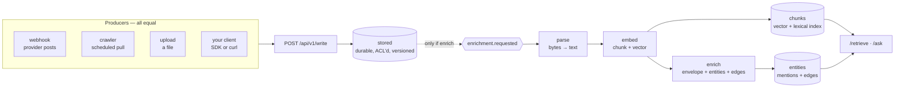
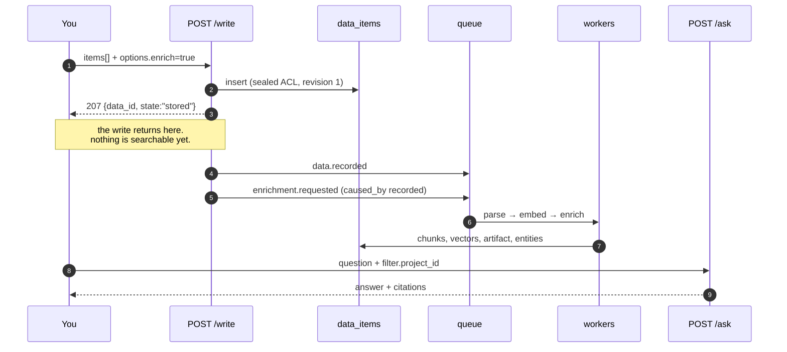
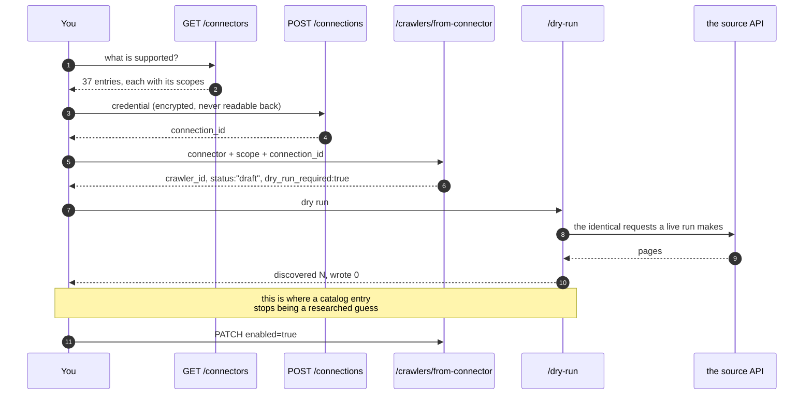
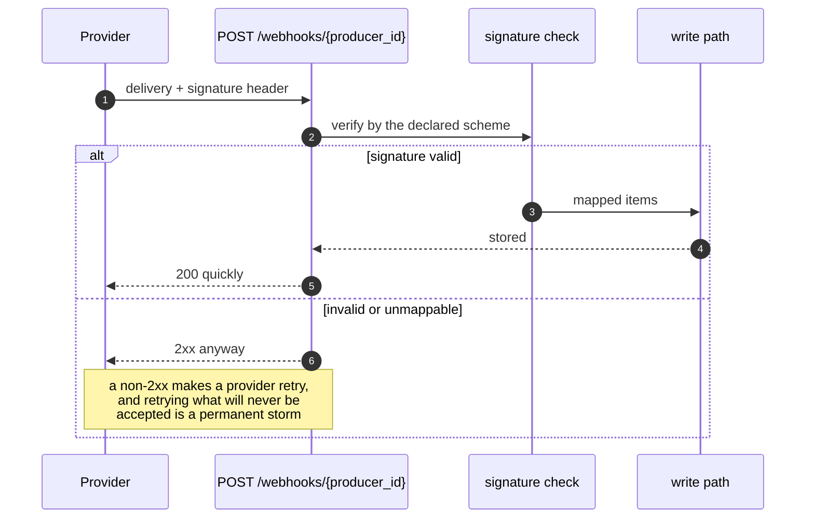
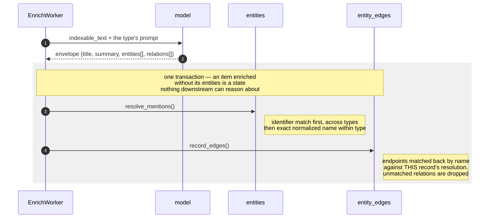
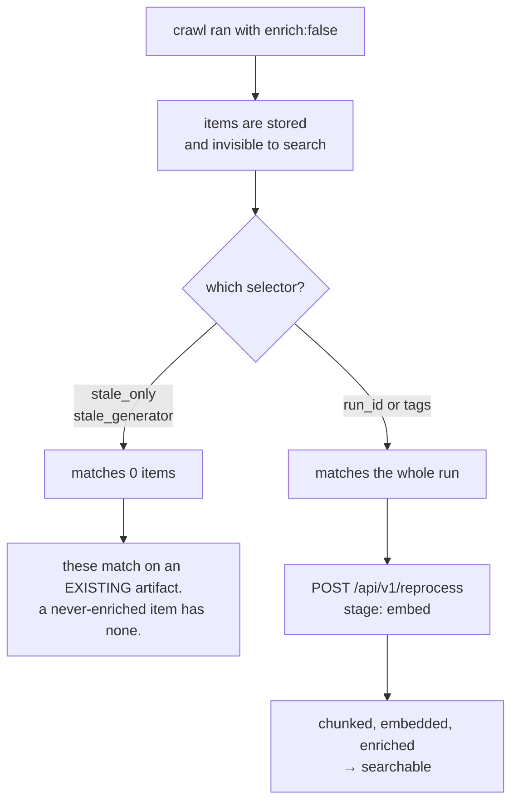
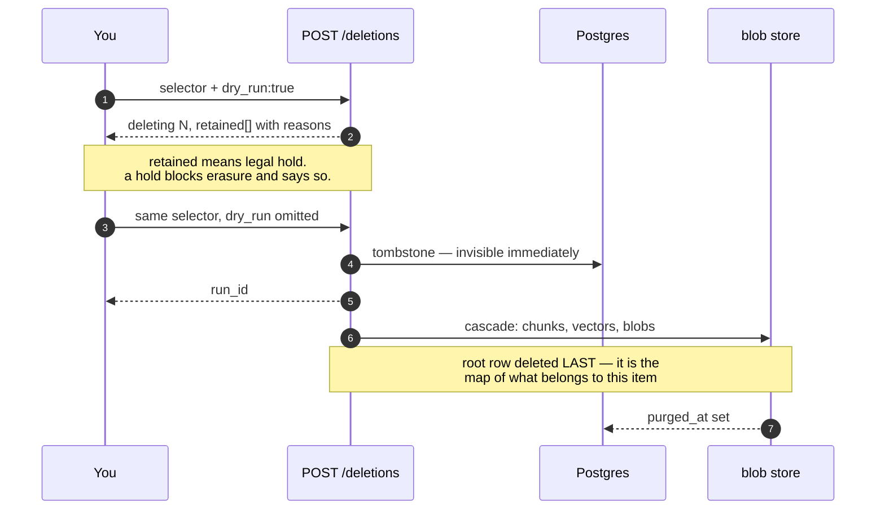
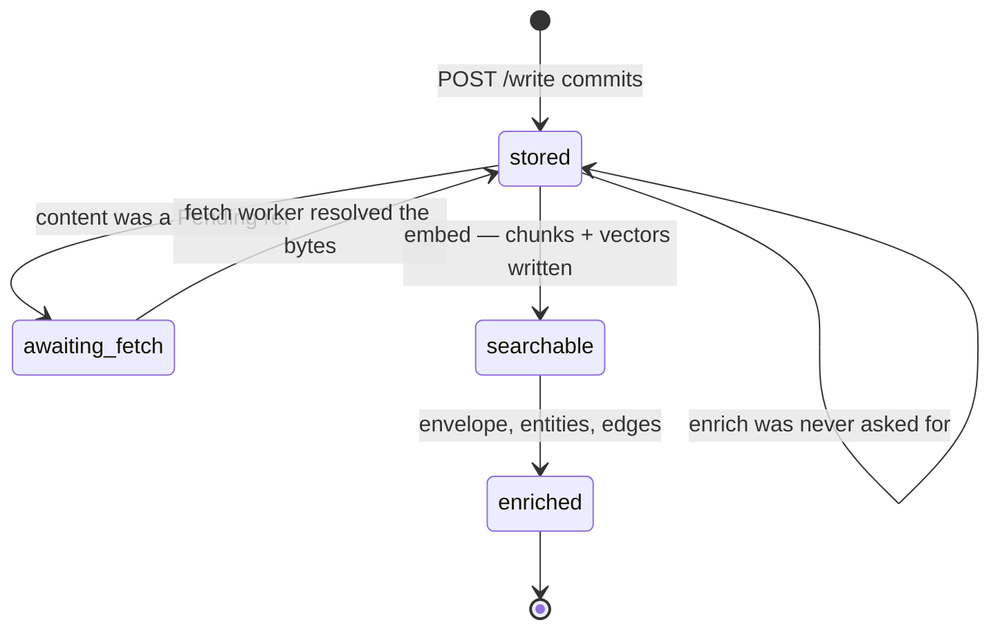

# Usage

Task-oriented, and written against the running system rather than the design. Every request here
was issued against a live deployment; every gotcha is one that actually bit.

The other documents say what the machinery **is**. This one says what you **type**, in what order,
and what you should see back. When the two disagree, this file is wrong — but check the version
note at the bottom first, because a few of these paths are newer than the prose elsewhere.

> **Set these once.** Every example assumes them.
>
> ```bash
> BASE=https://memdog-api-xxxx.run.app
> KEY=mdk_...            # X-API-Key or Authorization: Bearer — both reach the same verifier
> PRJ=prj_...
> ```

---

## The shape of every path

There is **one write verb**. A webhook, a crawler, an upload and your own client all converge on
`POST /api/v1/write`, and nothing downstream can tell them apart. Learn this picture once and every
scenario below is a variation on it.



**The dotted arrow is the one that surprises people.** Enrichment is opt-in. A stored item is
durable and correct and *completely invisible to search*, because both retrieval arms — vector and
lexical — read the `chunks` table, and chunks are written by the embed step. No enrichment, no
chunks, no results. See [Scenario 5](#scenario-5--backfill-a-crawl-that-ran-cold) if you find
yourself on the wrong side of this.

---

## Before anything: a project and a producer

```bash
curl -s -H "X-API-Key: $KEY" "$BASE/api/v1/projects"
curl -s -H "X-API-Key: $KEY" "$BASE/api/v1/producers?project_id=$PRJ"
```

A **producer** is who is writing. It carries the ACL scope, the rate limit, the quota attribution
and the enrichment default — which is why one exists per source rather than per user. Create one:

```bash
curl -s -X POST "$BASE/api/v1/producers" -H "X-API-Key: $KEY" \
  -H "content-type: application/json" \
  -d "{\"project_id\":\"$PRJ\",\"type\":\"client\"}"
```

`type` is `client`, `webhook` or `crawler`. The last two are usually created for you by the flows
below.

---

## Scenario 1 — Write something, then ask about it

The smallest complete loop, and the one to run first when something is wrong.



```bash
curl -s -X POST "$BASE/api/v1/write" -H "X-API-Key: $KEY" \
  -H "content-type: application/json" -d "{
  \"producer_id\": \"key_...\",
  \"items\": [{
    \"external_id\": \"note-1\",
    \"content\": {\"kind\": \"inline\", \"text\": \"We committed to SAML SSO for Acme by 30 September.\"},
    \"tags\": [\"source:notes\"],
    \"metadata\": {\"source_url\": \"https://example.internal/notes/1\"}
  }],
  \"options\": {\"enrich\": true}
}"
```

Three things about that body worth knowing:

- **`external_id` is the natural key.** Writing it again updates in place and drops the derived
  rows, so a re-crawl upserts rather than duplicating. Choose it from the source, not from a clock.
- **`tags` and `metadata` are different fields.** `tags` is a `text[]` you filter, reprocess and
  delete on. `metadata` is anything else you want carried. A `tags` key *inside* `metadata` is
  lifted into the column, because the docs showed that shape for a long time.
- **`options.enrich` decides whether any of this becomes searchable.** Leave it off for bulk you
  have not decided to spend money on.

Wait for it, then ask. **`/ask` takes a `filter` object, not a bare `project_id`** — the flat form
is a 422:

```bash
curl -s -H "X-API-Key: $KEY" "$BASE/api/v1/projects/$PRJ/staircase"
# {"total":1,"stored":0,"searchable":0,"enriched":1,...}

curl -s -X POST "$BASE/api/v1/ask" -H "X-API-Key: $KEY" \
  -H "content-type: application/json" \
  -d "{\"question\":\"What did we promise Acme?\",\"filter\":{\"project_id\":\"$PRJ\"}}"
```

For the raw passages instead of an answer, `POST /api/v1/retrieve` takes the same filter plus the
match axes:

```bash
-d "{\"query\":\"SSO commitment\",\"filter\":{\"project_id\":\"$PRJ\"},
     \"match\":[\"vector\",\"lexical\",\"graph\"],\"limit\":10}"
```

`graph` is an axis, not a default: it answers *what else is connected to this*, which is a different
question from *what matches this*, and it is only as good as the entity layer underneath it.

---

## Scenario 2 — Pull from an app you already use

Jira, Salesforce, Notion, Workday and 30-odd others are **catalog entries, not adapters** — a row of
knowledge about one API that renders into an ordinary crawler config. There is no per-source code.



**1 · See what is supported.** Readable without a credential:

```bash
curl -s "$BASE/api/v1/connectors" | python3 -m json.tool | head -40
```

Each entry declares its `scopes` — the things only you know. Jira wants a site URL and a JQL;
Salesforce wants an instance URL and a SOQL; Notion wants a database id.

**2 · Register the credential.** It is envelope-encrypted on the way in and **there is no endpoint
that reads one back out** — the listing reports whether one is held, never a prefix.

```bash
curl -s -X POST "$BASE/api/v1/connections" -H "X-API-Key: $KEY" \
  -H "content-type: application/json" -d "{
  \"project_id\": \"$PRJ\", \"provider\": \"jira\",
  \"credential\": \"you@example.com:your_atlassian_token\",
  \"auth_style\": \"basic\"
}"
```

Six styles, closed. Four are presented as stored (`bearer`, `header`, `query`, `basic`); two are
exchanged for a short-lived token before use (`client_credentials`, `google_service_account`) and
need an `auth_config` naming the `token_url` and scopes.

**3 · Create the crawler from the entry.**

```bash
curl -s -X POST "$BASE/api/v1/crawlers/from-connector" -H "X-API-Key: $KEY" \
  -H "content-type: application/json" -d "{
  \"project_id\": \"$PRJ\", \"connector\": \"jira\",
  \"connection_id\": \"conn_...\",
  \"scope\": {\"site\": \"https://acme.atlassian.net\",
              \"jql\": \"project = ENG AND updated >= -30d\"}
}"
```

**4 · Dry run, and read the count.** Every crawler is created disabled and draft and stays that way
until one passes. Editing the config invalidates it again, so "dry-run before enabling" cannot be
satisfied once and then edited around.

```bash
curl -s -X POST "$BASE/api/v1/crawlers/$CRW/dry-run" -H "X-API-Key: $KEY"
curl -s -H "X-API-Key: $KEY" "$BASE/api/v1/crawlers/$CRW/runs"
```

The dry run walks the identical code and stops short of the write, so its count is what a live run
would do — not a parallel estimate that drifts.

**5 · Enable it.**

```bash
curl -s -X PATCH "$BASE/api/v1/crawlers/$CRW" -H "X-API-Key: $KEY" \
  -H "content-type: application/json" -d '{"enabled": true}'
```

> **Nothing in the catalog is verified.** Every entry carries `verified: false`, and it means what it
> says: written from the provider's documented API, never exercised against a live account, because
> that needs somebody's credential. The dry run is where that changes. Treat a first run as a test.

### What the crawler actually emits

It **discovers and emits; it does not fetch and does not enrich.** Records go out as `Inline`, files
as `Pending` references for the fetch worker to resolve with the same credential. Every item is
tagged `crawler:<crawler_id>`, which is what makes [Scenario 5](#scenario-5--backfill-a-crawl-that-ran-cold)
possible.

If a connector's template has no `content_path`, the whole JSON record becomes the text. **That makes
your query the design decision** — `SELECT Id, Name FROM Account` gives an extractor one name and
nothing to relate it to. Widen it.

---

## Scenario 3 — Receive from a provider that pushes

Nine adapters: Slack, GitHub, Stripe, Linear, Shopify, Twilio, Microsoft Graph, Zoom, and `generic`.



The endpoint sits **outside `/api/v1` and is unauthenticated by the platform's own scheme** — the
producer declares how its provider proves itself, because not every provider can present a bearer
token.

```bash
# 1 · a producer to receive on
curl -s -X POST "$BASE/api/v1/producers" -H "X-API-Key: $KEY" \
  -H "content-type: application/json" -d "{\"project_id\":\"$PRJ\",\"type\":\"webhook\"}"

# 2 · how it authenticates and how its payload maps onto items
curl -s -X PATCH "$BASE/api/v1/producers/$WHK/inbound" -H "X-API-Key: $KEY" \
  -H "content-type: application/json" -d '{
  "inbound_auth": "signature",
  "mapping": {"provider": "slack"},
  "defaults": {"enrich": true}
}'
```

`inbound_auth` is one of `signature`, `api_key`, `url_secret`, `none`. Then give the provider
`$BASE/webhooks/$WHK`. Rotate the signing secret with an overlap — the previous secret keeps
verifying until the next rotation, so a rotation is not an outage.

---

## Scenario 4 — Build the knowledge graph

The graph is a by-product of enrichment, not a separate pipeline. It exists only for items that were
enriched.



```bash
curl -s -H "X-API-Key: $KEY" "$BASE/api/v1/projects/$PRJ/entities?limit=100"
curl -s -H "X-API-Key: $KEY" "$BASE/api/v1/entities/$ENT/graph"
curl -s -H "X-API-Key: $KEY" "$BASE/api/v1/entities/$ENT/co-mentions"
curl -s -H "X-API-Key: $KEY" "$BASE/api/v1/graph/predicates"
```

**Two kinds of connection, deliberately not merged.**

| | Stored? | Comes from |
|---|---|---|
| **Asserted edges** | yes, with predicate, source record and confidence | a model extracting a relationship the document *stated* |
| **Co-mentions** | no — computed at query time from `entity_mentions` | two entities named in the same record |

Co-mentions are why the graph is not empty before a model has ever extracted a relationship, which
matters more than it sounds: edge extraction needs a working model, co-mention needs nothing.

**Both vocabularies are closed.** Seven entity types (`person`, `organization`, `location`,
`product`, `event`, `topic`, `other`) and twelve predicates (`works_for`, `member_of`, `reports_to`,
`collaborates_with`, `located_in`, `part_of`, `owns`, `produces`, `uses`, `attended`, `about`,
`related_to`). Anything your domain calls something else lands in `related_to`.

**The constraint that decides your query design:** a relation whose endpoints were not both resolved
*in the same record* is dropped rather than guessed at. So if you want `Contact works_for Account`,
both names must appear in the same row's text — which for a CRM means denormalizing the join into
the query:

```sql
SELECT Id, Name, Title, Account.Name, Account.Industry FROM Contact
```

> **Worth saying plainly:** a CRM is already a graph, and `Contact.AccountId` is a certain fact.
> Re-deriving it with a model gives you a probabilistic edge where an exact one was available. There
> is no deterministic foreign-key → edge path today; the graph is model-derived. Normalization
> schemas (`POST /api/v1/schemas`) do give you free, model-less correlation on shared identifiers —
> but they feed case correlation and entity identity, not edges.

---

## Scenario 5 — Backfill a crawl that ran cold

You crawled with `enrich` off, looked at the count, and now want the corpus searchable. This is the
intended sequence, and the selector it needs is not the obvious one.



```bash
# everything one crawler pulled
curl -s -X POST "$BASE/api/v1/reprocess" -H "X-API-Key: $KEY" \
  -H "content-type: application/json" -d "{
  \"selector\": {\"project_id\": \"$PRJ\", \"tags\": [\"crawler:$CRW\"]},
  \"stage\": \"embed\"
}"

# or exactly one run of it
  \"selector\": {\"project_id\": \"$PRJ\", \"run_id\": \"$RUN\"}
```

`stage` is `embed` (re-chunk and re-embed — expensive) or `enrich` (rebuild the envelope only — what
you want after a prompt change). `tags` matches on **overlap**: any of these, not all of these.

---

## Scenario 6 — Erase something, and prove it

**Visibility is transactional; reclamation is eventual.** `deleted_at` is when it became invisible,
`purged_at` is when the bytes actually went — and an erasure certificate is issued against the
second. Reporting the first as the second is how a compliance answer becomes false.



```bash
curl -s -X POST "$BASE/api/v1/deletions" -H "X-API-Key: $KEY" \
  -H "content-type: application/json" -d "{
  \"selector\": {\"project_id\": \"$PRJ\", \"tags\": [\"source:notes\"]},
  \"reason\": \"customer request\",
  \"dry_run\": true
}"
```

**A selector must narrow something.** `project_id` alone is refused — "delete everything here"
cannot be expressed by accident. Narrow on `data_ids`, `producer_id`, `tags`, or a time range:

```bash
  \"selector\": {\"project_id\": \"$PRJ\",
                 \"time_clock\": \"event_time\",
                 \"since\": \"2026-01-01T00:00:00Z\"}
```

`time_clock` is required to be named when you use a range, and is `ingested_at` or `event_time` —
they answer different questions and a selector that does not say which is ambiguous exactly where it
matters. Instants are ISO-8601; a naive one is read as UTC.

---

## The readiness staircase

When a question returns nothing, this is the first thing to look at.



```bash
curl -s -H "X-API-Key: $KEY" "$BASE/api/v1/projects/$PRJ/staircase"
# {"total":42,"stored":0,"searchable":0,"enriched":42,"awaiting_fetch":0}
```

`stored` is durable but unfindable. `searchable` can be retrieved. `enriched` also has a summary,
entities and graph edges. A number sitting in `stored` is the answer to "why did my question return
nothing".

---

## When it returns nothing

| Symptom | Most likely cause | Check |
|---|---|---|
| Question returns no citations | items never enriched — no chunks, so neither retrieval arm can see them | `/staircase`, look at `stored` |
| `/ask` returns 422 | `project_id` sent flat instead of inside `filter` | `{"question":…,"filter":{"project_id":…}}` |
| Crawler will not enable | its dry run is not current for this config | re-run `/dry-run`; editing the config invalidates it |
| Crawler run fails with 401 | the credential was refused; the cached token is evicted | fix the connection, re-run — no need to recreate it |
| Crawl discovers 0 items | `items_path` does not match the payload, or the scope is wrong | dry run reports discovered vs written separately |
| Connector authenticates but returns nothing | a scope naming the wrong site/database/instance | scopes are yours to supply; nothing is defaulted |
| Item stuck in `awaiting_fetch` | no fetch worker, or the connection it names is gone | this is a correct waiting state, not a failure |
| Enrichment silently skipped | provider quota exhausted, or a data-type policy narrowed the extractor | `enrichment.refused` events; the reason is on the row |
| Graph has entities but no edges | both endpoints of a relation were not in the same record | denormalize the join into the source query |
| Tags missing on listing | `/projects/{id}/data` does not select the `tags` column | read one item with `GET /api/v1/data/{id}` |

---

## Where to go next

| You want | Read |
|---|---|
| What a connector entry contains, and how to add one | [ingestion/connectors.md](ingestion/connectors.md) |
| The crawl strategies and their bounds | [ingestion/crawlers.md](ingestion/crawlers.md) |
| The write contract in full | [ingestion/write-api.md](ingestion/write-api.md) |
| Why the graph is not a graph database | [graph.md](graph.md) |
| Who can see what | [security/access-model.md](security/access-model.md) |
| Retrieval modes and ranking | [retrieval/indexes.md](retrieval/indexes.md) |
| Running it | [operations/onboarding.md](operations/onboarding.md) |
